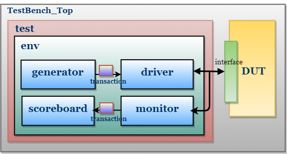

# D Flip-Flop (DFF) Verification Testbench - SystemVerilog

This project provides a verification environment for a D flip-flop (DFF) module using **SystemVerilog**. It follows a basic testbench structure and simulates the behavior of a DFF under different input conditions.

---

## 📁 Folder Structure

## Design Under Test (DUT)

The DUT is a simple D flip-flop with an asynchronous reset.

*   **File:** `design.sv`
*   **Inputs:**
    *   `clk`: Clock signal
    *   `reset`: Active low asynchronous reset
    *   `d`: Data input
*   **Outputs:**
    *   `q`: Data output
 
## Verification Environment

The verification environment is implemented in SystemVerilog and uses a traditional verification architecture, including the following components:

*   **Test Bench Top:** `testbench.sv`- Instantiates the DUT and the verification environment, generates clock and reset signals, and initiates the test.
*   **Interface:** `dff_if.sv` - Provides a common interface for connecting the DUT to the verification components.
*   **Environment:** `environment.sv` - Contains and orchestrates the other verification components.
*   **Generator:** `generator.sv` - Generates stimulus for the DUT.
*   **Driver:** `driver.sv` - Drives the generated stimulus to the DUT through the interface.
*   **Monitor:** `monitor.sv`- Captures the DUT's output and transforms it into transactions.
*   **Scoreboard:** `scoreboard.sv` - Compares the DUT's observed output with the expected output to verify correctness.
*   **Transaction:** `transaction.sv` - Defines the format of the data being sent to and received from the DUT.

## Test Bench Architecture

